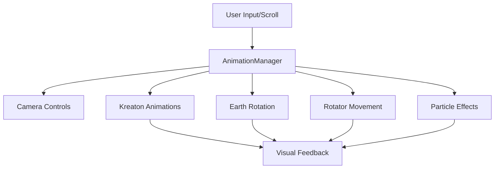

# Creative Directors Website - General Documentation

## Project Architecture Overview

### Core Components Structure
```
src/
├── components/
│   ├── AnimationManager.jsx        # Central animation control system
│   ├── SceneCanvas.jsx            # Main 3D scene container
│   ├── Kreaton.jsx                # Base character component
│   ├── Kreaton_A.jsx              # Advanced character features
│   ├── Earthv4_UV.jsx             # Earth model with UV mapping
│   ├── Clump.jsx                  # Particle system and effects
│   ├── Carosel.jsx                # 3D carousel component
│   ├── PointingFinger.jsx         # Interactive pointing element
│   ├── Finger.jsx                 # Base finger component
│   ├── FingerFixed.jsx            # Optimized finger component
│   ├── CD_header_v1.jsx           # Header component
│   ├── CD_header_v1_untransformed.jsx  # Raw header component
│   ├── Site-headings.jsx          # Site navigation and headings
│   ├── FontWorkWebpage.jsx        # Typography and text components
│   └── unused/                    # Deprecated components
├── utils/
│   ├── useSmoothScroll.jsx        # Custom scroll hook
│   ├── animationUtils.js          # Animation helper functions
│   ├── animationControlSystem.js  # Animation control utilities
│   └── caroselUtil.js            # Carousel helper functions
├── models/                        # 3D model assets
├── materials/                     # Three.js materials
├── shaders/                       # Custom GLSL shaders
├── assets/                        # Static assets
├── App.jsx                        # Main application component
└── main.jsx                       # Application entry point
```

### Architecture Layers

1. **Presentation Layer**
   - UI Components (CD_header_v1, Site-headings, FontWorkWebpage)
   - 3D Scene Components (SceneCanvas, Earthv4_UV, Kreaton)
   - Interactive Elements (PointingFinger, Carosel)

2. **Animation Layer**
   - AnimationManager (Central control)
   - Animation Utilities (animationUtils.js, animationControlSystem.js)
   - GSAP Integration
   - Scroll-based Animations (useSmoothScroll.jsx)

3. **3D Rendering Layer**
   - Three.js Integration
   - Custom Shaders
   - Material System
   - Model Management

4. **Utility Layer**
   - Helper Functions
   - Custom Hooks
   - Performance Optimizations
   - State Management

### Key Architectural Patterns

1. **Component Hierarchy**
   ```
   App
   ├── SceneCanvas
   │   ├── AnimationManager
   │   ├── Kreaton
   │   ├── Earth
   │   ├── Clump
   │   └── Carosel
   └── UI Components
       ├── CD_header
       ├── Site-headings
       └── FontWorkWebpage
   ```

2. **Data Flow**
   - Top-down props flow
   - Centralized animation control
   - Event-driven updates
   - State management through refs

3. **Performance Considerations**
   - Component splitting for better performance
   - Optimized 3D models
   - Efficient animation system
   - Proper cleanup and memory management

4. **Development Patterns**
   - Component-based architecture
   - Custom hooks for reusable logic
   - Utility functions for common operations
   - Clear separation of concerns

## Component Interactions

### 1. AnimationManager
**Inputs:**
- Refs from all major components (kreatonRef, earthRef, rotatorRef, etc.)
- Scroll events from the page
- User interactions

**Outputs:**
- Camera movements and positions
- Animation triggers
- Timeline controls
- Debug information

**Key Responsibilities:**
- Orchestrates all animations
- Manages camera movements
- Controls scroll-based sequences
- Handles component state transitions

### 2. Kreaton (Character)
**Inputs:**
- Animation triggers from AnimationManager
- User interactions
- Timeline events

**Outputs:**
- Character animations
- Position updates
- Animation state changes

**Key Features:**
- Multiple animation states (walk, salute, idle)
- Crossfade between animations
- Facial expressions
- Physics-based movements

### 3. Earth
**Inputs:**
- Rotation controls from AnimationManager
- Timeline events

**Outputs:**
- Rotation state
- Position updates
- Visual effects

**Key Features:**
- Smooth rotation
- State management
- Visual effects integration

### 4. Rotator
**Inputs:**
- Position commands from AnimationManager
- Timeline events

**Outputs:**
- Container rotation
- Position updates
- Child component transformations

**Key Features:**
- Smooth movement
- Child component management
- Position interpolation

### 5. Clump (Particle System)
**Inputs:**
- Activation triggers from AnimationManager
- Timeline events

**Outputs:**
- Particle effects
- Visual feedback
- State changes

**Key Features:**
- Particle generation
- Effect management
- Performance optimization

## Data Flow



## Development Guidelines

### 1. Adding New Components
1. Create component in appropriate directory
2. Register refs in AnimationManager
3. Add necessary animation controls
4. Implement cleanup functions
5. Add debug logging

### 2. Animation Integration
1. Use GSAP for smooth animations
2. Implement proper cleanup
3. Add debug logging
4. Consider performance impact
5. Test on different devices

### 3. Performance Optimization
1. Use proper Three.js optimization techniques
2. Implement level of detail (LOD)
3. Optimize particle systems
4. Use proper cleanup
5. Monitor memory usage

## Future Development Suggestions

### 1. Performance Improvements
- Implement WebGL 2.0 features
- Add WebAssembly for heavy computations
- Optimize shader code
- Implement better asset loading

### 2. Feature Additions
- Add more interactive elements
- Implement touch controls
- Add more particle effects
- Create additional animation sequences

### 3. Code Structure
- Implement TypeScript
- Add unit tests
- Improve error handling
- Add more documentation

### 4. User Experience
- Add loading states
- Implement better error feedback
- Add accessibility features
- Improve mobile experience

## Debug Tools

### 1. Built-in Tools
- Color-coded console logging
- Timeline visualization
- Performance monitoring
- State tracking

### 2. External Tools
- Three.js Inspector
- React DevTools
- Performance Profiler
- Network Monitor

## Common Issues and Solutions

### 1. Performance Issues
- Check for memory leaks
- Optimize 3D models
- Reduce particle count
- Implement proper cleanup

### 2. Animation Glitches
- Check timeline conflicts
- Verify proper cleanup
- Monitor state changes
- Check for race conditions

### 3. Loading Issues
- Implement proper loading states
- Check asset loading
- Monitor memory usage
- Verify proper initialization

## Best Practices

### 1. Code Organization
- Keep components modular
- Use proper naming conventions
- Implement proper error handling
- Add comprehensive documentation

### 2. Animation
- Use GSAP for smooth animations
- Implement proper cleanup
- Add debug logging
- Consider performance impact

### 3. 3D Assets
- Optimize models
- Use proper materials
- Implement LOD
- Monitor memory usage

### 4. Performance
- Monitor frame rate
- Optimize shaders
- Reduce draw calls
- Implement proper cleanup

## Testing Guidelines

### 1. Unit Tests
- Test individual components
- Verify state changes
- Check animation triggers
- Test cleanup functions

### 2. Integration Tests
- Test component interactions
- Verify animation sequences
- Check performance
- Test error handling

### 3. Performance Tests
- Monitor frame rate
- Check memory usage
- Test on different devices
- Verify loading times

## Deployment Checklist

1. Optimize assets
2. Verify all animations
3. Check performance
4. Test on different devices
5. Verify error handling
6. Check loading states
7. Verify cleanup
8. Test user interactions

## Maintenance

### 1. Regular Checks
- Monitor performance
- Check for memory leaks
- Verify animations
- Test user interactions

### 2. Updates
- Keep dependencies updated
- Check for breaking changes
- Verify compatibility
- Test new features

### 3. Optimization
- Monitor performance
- Optimize assets
- Update shaders
- Improve loading times 